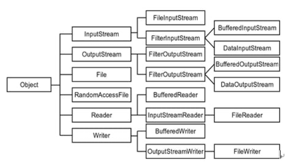

# 09-03

### 예외처리(2)

### throws

```java
public class Exception1 {
    public static void main(String[] args) {
        try {
            ExceptionObj1 exobj = new ExceptionObj1();
            int value = exobj.divide(10, 0); //<-여기로 전파, catch블록이 있으므로 catch 실행
            System.out.println(value);
        } catch(ArithmeticException ex) {
            System.out.println("0으로 나눌 수 없습니다.");
        }
    }
}

class ExceptionObj1 {
    public int divide(int i, int k) throws ArithmeticException {
        int value = 0;
        value = i / k; // 예외가 발생하면 호출한 곳으로 전파
        return value;
    }
}
```

### 사용자 정의 예외 클래스 작성

```java
class MyException extends Exception {
    public MyException(String message) {
        super(message); // 부모 Exception 클래스의 생성자에 메시지 전달
    }
}
```

```java
public class CustomExceptionTest {
    public static void main(String[] args) {
        try {
            checkNumber(-5);  // 음수를 전달 -> 예외 발생
        } catch (MyException e) {
            System.out.println("예외 발생: " + e.getMessage());
        }
    }

    // 숫자가 0보다 작으면 사용자 정의 예외 발생
    static void checkNumber(int num) throws MyException {
        if (num < 0) {
            throw new MyException("0보다 작은 숫자는 허용되지 않습니다!");
        }
        System.out.println("정상 숫자: " + num);
    }
}
// 예외 발생: 0보다 작은 숫자는 허용되지 않습니다!
```

- MyException이라는 내가 직접 만든 예외 클래스를 만들고, 특정 조건일 때 throw new MyException(””)로 던질 수 있다.

**throw:** 예외를 강제로 발생시킴 / throw new MyException();

**throws:** 메소드가 예외를 던질 수 있음을 선언 / method() throws MyException

### throws와 try-catch의 차이점

- 차이점 요약

| 구분 | throws | try-catch |
| --- | --- | --- |
| 위치 | 메소드 선언부 | 코드 블록 |
| 역할 | 예외를 호출한 곳으로 전달 | 예외를 실제로 처리 |
| 실행 여우 | 예외 발생 시 호출한 곳으로 전파 | 예외 발생 시 catch블록 실행 |
| 목적 | 예외 책임을 위임 | 예외 발생 시 대응 |

---

### Java IO

자바에서 입출력(IO)은 프로그램이 외부 세계와 상호작용하는 핵심 기능.

IO가 필요한 상황들: 사용자로부터 키보드 입력받기, 화면에 결과 출력하기, 파일에 데이터 저장하고 읽기, 네트워크를 통한 데이터 전송, 데이터베이스와의 통신

### 스트림(Stream)의 개념

스트림은 데이터가 흐르는 통로를 추상화한 개념, 물이 파이프를 통해 흐르듯이 데이터가 스트림을 통해 이동한다.

[데이터 소스] —> [입력 스트림] —> [프로그램] —> [출력 스트림] —> [데이터 대상]

### 클래스 계층 구조



### 스트림의 분류

Java IO는 크게 4개의추상 클래스를 중심으로 구성된다.

1. **InputStream**: 바이트 단위 입력
2. **OutputStream**: 바이트 단위 출력
3. **Reader**: 문자 단위 입력
4. **Writer**: 문자 단위 출력

**데이터 단위에 따른 분류**

- 바이트 스트림(Byte Stream): 1바이트 단위로 처리
- 문자 스트림(Character Stream): 2바이트(char) 단위로 처리

**데이터 흐름에 따른 분류**

- 입력 스트림 (Input Stream): 데이터를 읽어오는 스트림
- 출력 스트림 (Output Stream): 데이터를 내보내는 스트림

### **입력 스트림( InputStream ) 계열**

| 클래스 | 용도 |
| --- | --- |
| FileInputStream | 파일에서 바이트 단위로 읽기 |
| ByteArrayInputStream | 바이트 배열에서 읽기 |
| BufferedInputStream | 버퍼를 이용한 효율적인 읽기 |
| DataInputStream | 기본 데이터 타입 읽기 |

### **출력 스트림( Output Stream ) 계열**

| 클래스 | 용도 |
| --- | --- |
| FileOutputStream | 파일에 바이트 단위로 쓰기 |
| ByteArrayOutputStream | 바이트 배열에 쓰기 |
| BufferedOutputStream | 버퍼를 이용한 효율적인 쓰기 |
| DataOutputStream | 기본 데이터 타입 쓰기 |

### 바이트 스트림 예제 코드

```java
import java.io.FileInputStream;
import java.io.FileOutputStream;
import java.io.IOException;

public class ByteStreamExample {
    public static void main(String[] args) {
        // try-with-resources를 사용한 자동 리소스 관리
        try (FileInputStream in = new FileInputStream("input.jpg"); //
             FileOutputStream out = new FileOutputStream("output.jpg")) {

            int byteData;
            // 파일 끝(-1)까지 한 바이트씩 읽기
            while ((byteData = in.read()) != -1) {
                out.write(byteData);
            }
            System.out.println("파일 복사 완료!");

        } catch (IOException e) {
            System.err.println("파일 처리 중 오류: " + e.getMessage());
        }
    }
}
```

1. in 변수로 파일 내용을 읽을 수 있음
2. out 변수로 데이터를 파일에 쓸 수 있음
    1. 파일이 없으면 새로 생성, 있으면 덮어쓰기
3. 한바이트씩 읽어서 int로 변환 → byteDate에 저장
    1. 파일 끝까지 한 바이트씩 읽어서 그래도 다른 파일에 쓴다 → 파일 복사 기능
4. 
    
    
    | 사용 | 출력 내용 | 용도 |
    | --- | --- | --- |
    | e | 예외 클래스 이름 + 메시지 전체
    예: java.io.FileNotFoundException: input.jpg (지정된 파일을 찾을 수 없습니다) | 디버깅할 때, 어떤 예외가 발생했는지 전체 정보 확인 |
    | e.getMessage() | 예외 메시지 부분만
    예: input.txt (지정된 파일을 찾을 수 없습니다) | 사용자에게 보여줄 때 깔끔하게 전달 |
    |  | (지정된 파일을 찾을 수 없습니다) | 자바 표준 라이브러리에서 예외 객체를 생성할 때 자동으로 넣어주는 메시지 |
