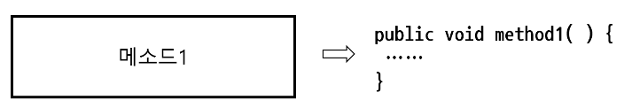
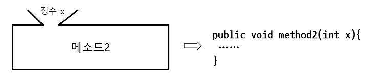
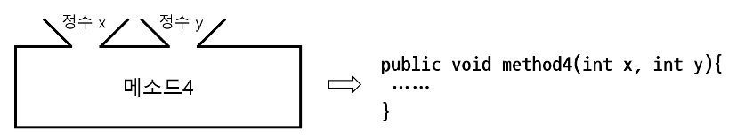
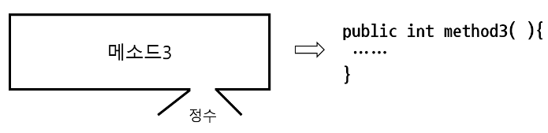
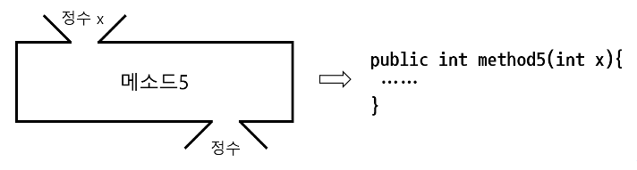

# 객체 지향

## 객체 지향 프로그램

객체 지향 프로그래밍은 컴퓨터 프로그래밍의 패러다임 중 하나이다.

객체 지향 프로그래밍은 컴퓨터 프로그램을 명령어의 목록으로 보는 시각에서 벗어나 여러 개의 독립된 단위, 즉 “객체” 들의 모임으로 파악하고자 하는 것이다. 각각의 객체는 메시지를 주고받고, 데이터를 처리할 수 있다.

## 클래스와 객체

클래스 = 설계 도면 객체/인스턴스 = 설계 도면을 보고 실제로 만든 것

| 개념 | 설명 | 비유 |
| --- | --- | --- |
| 클래스 (Class) | 객체를 만들기 위한 설계도 | 붕어빵 틀, 설계 도면 |
| 객체 (Object) | 클래스로부터 만들어진 실체 | 붕어빵, 실제건물 |
| 인스턴스 (Instance) | 메모리에 생성된 객체 | 구체적인 실체 |
| 참조 변수 (Reference Variable) | 인스턴스를 가르키는 변수 | 리모컨, 이름표 |

참조되지 않은 인스턴스는 쓰레기가 되며, 나중에 가비지 컬렉션에 의해 메모리에서 제거됩니다.

## 클래스 선언 규칙

접근제한자 class 클래스이름 {

              필드들;

              생성자들;

              메소드들;

}

클래스 명명 규칙

첫 문자가 문자나 ‘_’, ‘$’의 특수문자로 시작되어야 한다. 숫자로 시작할 수 없다

첫 문자가 아니라면 문자, ‘_’, ‘$’의 특수문자 그리고 숫자로 구성될 수 있다.

자바의 에약어는 식별자로 사용할 수 없다.

자바의 식별자는 대소문자를 구분한다.

식별자 길이는 제한이 없고 공백은 포함할 수 없다.

프로그래머간의 관례

클래스 명은 대문자로 시작합니다.

단어와 단어가 만날 경우 2번째 단어의 시작은 대문자로 시작합니다. 

ex) HelloWorld

클래스는 필드와 메소드를 가진다.

필드는 클래스의 속성이라고 말할 수 있습니다.

메소드는 클래스의 기능이라고 말할 수 있습니다.

## 객체 생성과 사용

클래스명 변수명 = new 클래스명();

ㅣ                  ㅣ             ㅣ      ↳ 생성자

ㅣ                  ㅣ               ↳ new연산자 

 ↳ 참조타입 ↳ 참조변수

main메소드가 없는 클래스는 실행되지 않습니다.

다른 클래스에서 사용되기 위한 클래스입니다.

객체 생성의 3가지 방법

1. new 연산자와 생성자 사용 (가장 일반적)
2. 클래스 로더를 이용하는 방법
3. 메모리에 있는 인스턴트를 복제하는 방법

## 필드

클래스가 가지는 속성을 자바에서는 필드라고 합니다

다른 언어에서는 멤버 변수라고 도 합니다

객체의 상태 정보를 저장합니다.

필드 선언 문법→ [접근제한자] [static] [final] 타입 필드명 [= 초기값] ;

필드의 기본값

| 타입 | 기본값 |
| --- | --- |
| 정수형 (byte, short, int, long) | 0 |
| 실수형 (float, double) | 0.0 |
| 문자형 (char) | '\u0000’ |
| 논리형 (boolean) | false |
| 참조형 (클래스, 배열 등) | null |

## 메소드 (Method)

하나의 객체는 메시지를 전송함으로써 다른 객체에 접근한다.

객체의 행동을 유발하는 행위를 가르켜 메시지-전송 이라고 한다.

메시지-전송 매커니즘은 객체가 다른 객체에 접근할 수 있는 유일한 방법이다.

메소드 선언 문법

[접근제한자] [static] 리턴type 메소드이름([매개변수 , …….]) {

          실행문

              …….

}

다양한 메소드 형태

매개변수 vs 전달인자

매개변수: 메소드 정의 시 선언하는 변수

전달인자: 메소드 호출 시 전달하는 실제 값!!