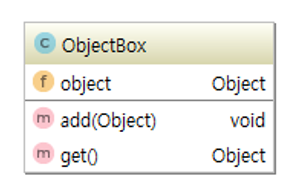

# 0902정리

## 컬렉션 프레임워크

자바의 컬렉션 프레임워크와 제네릭에 대해 학습함

먼저 제네릭의 개념과 사용법을 이해한 후 자바 컬렉션 프레임워크의 핵심 인터페이스들 (Colleciong, List, Set, Map)과 구현 클래스들을 실습 다양한 자료구조의 사용 시나리오를 이해하고 실제 프로그래밍에서 활용

### 학습 목표

1. 제네릭의 개념과 장점을 이해하고 활용할 수 있다
2. 컬렉션 프레임워크의 핵심 인터페이스들을 구분할 수 있다.
3. List, ASet, Map의 특성과 차이점을 설명할 수 있다.
4. ArrayList, HashSet, HashMap 등 주요 구현 클래스를 사용할 수 있다.
5. Iterator를 사용하여 컬렉션을 순회할 수 있다.
6. Coolections 클래스의 유틸리티 메소드들을 활용할 수 있다.

## 제네릭 (Generic)

클래스 내부에서 지정하는 것이 아닌 외부에서 사용자에 의해 지정되는 것을 의미한다.

특정 타입을 미리 지정해주는 것이 아닌 필요에 의해 지정할 수 있도록 하는 일반 타입을 말한다.

### Generic 의 장점

1. 제네릭을 사용하면 잘못된 타입이 들어올 수 있는 것을 컴파일 단계에서 방지할 수 있다.
2. 클래스 외부에서 타입을 지정해주기 때문에 따로 타입을 체크하고 변환해줄 필요가 없다. (관리가 편하다)
3. 비슷한 기능을 지원하는 경우 코드의 재사용성이 높아진다.

Object를 사용하여 ObjectBox를 만들면

### ObjectBox의 문제점

1. 어떤 Object든 저장할 수 있고, 어떤 Object를 꺼낼 수 있습니다.
2. 꺼내서 사용할 때는 원래 타입으로 변환시키는 번거로운 과정이 필요합니다.
3. 잘못된 타입으로 캐스팅 할 경우 런타임 오류가 발생할 수 있습니다.

### Generic을 사용한 GenericBox

public class GenericBox<T> {
private T t;

public void add(T obj) {
    this.t = obj;
}

public T get() {
    return this.t;
}

}

### Generic 문법

1. T는 제네릭과 관련된 부분입니다.
2. 제네릭은 클래스이름 뒤나 메소드의 리턴타입 앞에 붙을 수 있습니다.
3. <T> 부분은 T 라는 이름의 제네릭 타입을 선언한다는 것을 의미합니다.
4. T는 Type의 약자기 때문에 많이 사용되는 문자이지만 꼭 T를 쓸 필요는 없습니다.

### 제네릭의 장점

1. 정해진 타입만 사용하도록 강제할 수 있습니다.
2. 타입을 강제함으로써 컴파일할 때 잘못된 타입의 값이 저장되는 것을 막을 수 있습니다.
3. 형변환 (casting)이 불필요합니다.
4. 컴파일 타임에 타입 안전성을 보장합니다.

## 컬렉션 프레임워크 (Collection Framework)

### 컬렉션 프레이워크란?

Java Collections Framework 라고 불리는 Collections API는 Java 2부터 추가된 자료구조 클래스 패키지를 말합니다.

자료를 다룰 때 반드시 필요한 클래스의 모음으로써 Java 프로그래머라면 꼭 숙지하고 있어야 합니다.

### 핵심 인터페이스 소개

**java.util.Collection 인터페이스**

- java.util.Collection 인터페이스는 컬렉션 프레임워크에서 **가장 기본이 되는 인터페이스**입니다.
- 해당 인터페이스는 순서를 기억하지 않고, 중복을 허용하여 자료를 다루는 목적으로 만들어졌습니다.

**java.util.List 인터페이스**

- java.util.List 인터페이스는 **순서가 중요한 자료**를 다룰때 사용하는 인터페이스입니다.
- Collection을 상속받음으로써 Collection이 가지고 있는 add(), size(), iterator() 메소드를 사용할 수 있습니다.
- 해당 인터페이스는 순서를 알고 있다고 가정하기 때문에 **특정 순서로 저장된 자료를 꺼낼 수 있는 get(int) 메소드**를 가지고 있습니다.

**java.util.Set 인터페이스**

- java.util.Set 인터페이스는 **중복을 허용하지 않는 자료**를 다룰 때 사용하는 인터페이스입니다.
- 중복을 허용하지 않는다는 것은 같은 값을 저장할 수 없다는 것입니다.
- 같은 값을 여러번 추가하여도 마지막 값 하나만 저장됨을 의미합니다.

### Set 사용시 주의사항 - Set 인터페이스에 저장되는 객체들은 Object가 가지고 있는 equals() 메소드와 hashCode() 메소드를 오버라이딩해야 합니다.

**java.util.Iterator 인터페이스**

- java.util.Iterator 인터페이스는 **자료구조에서 자료를 꺼내기 위한 목적**으로 사용되는 인터페이스입니다.
- Iterator 패턴을 구현하고 있습니다.

 **java.util.Map 인터페이스**

- java.util.Map 인터페이스는 **키(Key)와 값(Value)를 함께 저장**하기 위한 목적으로 만들어진 인터페이스입니다.
- 같은 Key값으론 하나의 값만 저장할 수 있습니다.