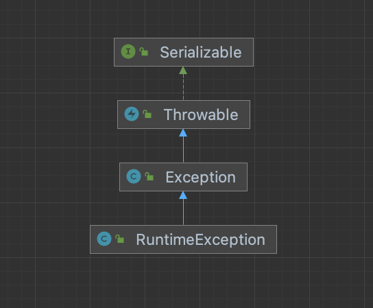

# 0903정리

## 예외 처리

자바에서 예외 처리의 개념과 활용법을 학습합니다. 프로그램 실행 중 발생할 수 있는 다양한 예외 상황을 이해하고, try-catch, throws, finally 등을 사용하여 안정적인 프로그램을 작성하는 방법을 익힙니다. Error와 Exception의 차이점, RuntimeException과 Checked Exception의 구분, 사용자 정의 예외 생성까지 예외 처리의 전반적인 내용을 다룹니다.

### 예외 처리란?

예외 처리는 프로그램 실행 중에 발생할 수 있는 예상치 못한 상황(예외)에 대비하여 프로그램의 정상적인 흐름을 유지하고 예외 상황을 안전하게 처리하는 프로그래밍 기법입니다.

### 예외 처리가 필요한 이유

1. 프로그램의 안전성과 신뢰성 보장 - 예외 처리 프로그램이 예상치 못한 상황에서도 중단되지 않고 계속 실행될 수 있습니다.
2. 오류의 조기 발견 및 대응 - 오류 메세지를 통해 문제가 발생한 원인과 위치를 파악할 수 있습니다.
3. 사용자 경험 개선 - 적절한 예외 처리로 사용자에게 명확하고 이해하기 쉬운 피드백을  제공할 수 있습니다.
4. 시스템 자원의 안전한 관리 - finally 블록이나 try-with-resources를 통해 필수적인 자원 해제 작업을 보장합니다.

### 예외 처리를 하지 않으면 발생하는 문제

public class WithoutExceptionHandling {
public static void main(String[] args) {
int[] numbers = {1, 2, 3};
System.out.println(numbers[3]); // ArrayIndexOutOfBoundsException 발생
System.out.println("프로그램 종료"); // 이 코드는 실행되지 않음
}
}

1. 프로그램이 비정상적으로 중단됩니다.
2. 데이터 손실이 발생할 수 있습니다.
3. 보안 취약점이 노출될 수 있습니다.
4. 사용자 경험이 저하됩니다.

## Error 와 Exception

프로그램이 비정상적으로 종료되는 원인들을 살펴보겠습니다.

### 컴파일 에러

1. 컴파일 시 발생하는 에러
2. 문법 오류, 타입 불일치 등

### 런타임 에러

1. 실행 시 발생하는 에러
2. 메모리 부족, 0으로 나누기 등

### 자바의 실행 시 오류 분류

1. Error : 수습할 수 없는 심각한 오류
2. Exception : 예외 처리를 통해 수습할 수 있는 덜 심각한 오류

## try-catch 문법

try 블록에는 예외발생 가능 코드가 위치하고 만일 코드에 오류가 발생되면, 오류 종류(예외 클래스)에 맞는 catch 문으로 가서 catch 블록 안에 있는 코드를 실행 시킨다. 만일 오류가 발생하지 않으면 catch 문은 실행하지 않는다.

try {
코드1
코드2
// ...
} catch(Exception클래스명1 변수명1) {
Exception을 처리하는 코드
} catch(Exception클래스명2 변수명2) {
Exception을 처리하는 코드
}

### 예외 떠넘기기 (throws)

예외"란 무언가 예외적인 상황이나 에러가 발생했음을 가리키는 신호이다.

예외를 "발생시키다(throw)"라는 것은 그러한 에러나 예외 상황을 알린다는 뜻이다.

한편, 예외를 "잡아내다(catch)"라는 것은 예외를 처리한다는 뜻인데, 즉 그 예외를 회복하기 위해 무언가 필요하거나 적절한 행동을 취한다는 뜻이다.

정리하자면, 예외를 강제로 발생시켜야 할 경우가 생길 때는 "throw"를 사용하고, 그 예외를 잡아내는 데에는 "try/catch/finally"를 사용한다.

리턴타입 메소드명(아규먼트 리스트) throws Exception클래스명1, Exception클래스명2... {
코드1
코드2
// ...
}

## RuntimeException과 CheckedException

예외 클래스 계층구조

### 예외 유형 구분

1. RuntimeException (언체크 예외)
2. 컴파일러가 예외 처리를 강제하지 않음
3. 프로그래머의 실수로 발생하는 예외
4. 예 : NullPointerException, ArrayIndexOutOfBoundsException, ArithmeticException
5. Checked Exception (체크 예외)
6. 컴파일러가 예외 처리를 강제함
7. 외부 환경에 의해 발생하는 예외
8. 예 : IOException, ClassNotFoundException, SQLException

## 여러 예외를 처리하는 방법

public class Exception6 {
public static void main(String[] args) {
// {4,2} 로 바꿔서 실행해보고. int[] array = null로도 바꿔본다.
int[] array = {4, 0};
int[] value = null;

    try {
        value[0] = array[0] / array[1];
    } catch(ArrayIndexOutOfBoundsException aiob) {
        System.out.println(aiob.toString());
    } catch(ArithmeticException ae) {
        System.out.println(ae.toString());
    } catch(NullPointerException npe) {
        System.out.println("null 참조 오류: " + npe.toString());
    } catch(Exception ex) {
        System.out.println("기타 예외: " + ex);
    }
}

}

### 다중 catch 주의사항

1. 구체적인 예외를 먼저 처리해야 합니다.
2. Exception은 모든 예외의 부모 클래스 이므로 가장 마지막에 위치해야 합니다.
3. 상위 클래스 예외를 먼저 catch하면 하위 클래스 예외는 도달할 수 없습니다.

## 사용자 정의 예외

프로그램을 개발하다보면 자바 표준 API가 제공하는 예외 클래스만으로 다양한 종류의 예외를 다 표현할 수 없습니다. 이때, 직접 정의하여 사용하는 예외를 사용자 정의 예외라고 합니다.

1. 사용자 정의 예외는 반드시 java.lang.Exception 클래스를 상속받아 정의해야합니다.
2. 사용자 정의 예외는 JVM에서 예외를 발생시켜 주지 않으므로 직접 예외를 생성해야합니다.
3. 예외 생성 하기 : throw new 사용자정의예외 ()

public class MyException extends RuntimeException {
public MyException(String msg) {
super(msg);
}

public MyException(Exception ex) {
    super(ex);
}

}

### throw와 throws의 차이

throw : 예외를 강제로 발생시킴

throws: 메소드가 예외를 던질 수 있음을 선언

### try-with-resources

**try-with-resources**는 자바 7에서 도입된 구문으로, 자원을 명시적으로 닫는 코드를 작성하지 않고도 안전하게 자원을 관리할 수 있도록 돕는다. 이 구문을 사용하면 자원을 자동으로 해제해 주며, 코드가 더 간결하고 오류가 발생할 확률이 줄어든다. **AutoCloseable** 인터페이스를 구현한 자원은 모두 이 구문에서 사용할 수 있다.

## 예외 정보를 얻어야 하는 이유

예외 정보를 얻는 것은 문제를 해결하고 디버깅 하는 데 필수적입니다.

1. 문제의 원인 파악 : 예외 정보에는 예외가 발생한 원인에 대한 상세한 설명이 포함되어 있습니다.
2. 정확한 디버깅 : 예외가 발생한 코드의 위치 (파일명, 라인 번호) 를 파악할 수 있습니다.
3. 효율적인 문제 해결 : 예외의 종류와 메시지를 이해하면 더 효율적으로 문제를 해결할 수 있습니다.

## 예외 정보 메소드

1. getMessage() : 예외에 대한 기본적인 설명 메시지를 반환
2. printStackTrace() : 예외 발생 시의 호출 스택을 출력
3. getStackTrace() : 예외가 발생한 위치의 상세한 정보를 제공

# 자바 IO

### 자바 IO가 필요한 이유

자바에서 입출력(IO)은 프로그램이 외부 세계와 상호작용하는 핵심 기능입니다.

IO가 필요한 상황들 : - 사용자로부터 키보드 입력 받기 - 화면에 결과 출력하기 - 파일에 데이터 저장하고 읽기 - 네트워크를 통한 데이터 전송 - 데이터베이스와의 통신

### 자바 IO의 설계 철학

### 1. 유연성 (Flexibility)

- 다양한 데이터 소스와 대상 지원
- 파일, 네트워크, 메모리 등 동일한 인터페이스로 처리
- 코드의 재사용성 향상

### 2. 확장성 (Extensibility)

- 새로운 입출력 타입 쉽게 추가 가능
- 사용자 정의 스트림 구현 가능
- 데코레이터 패턴을 통한 기능 확장

### 3. 재사용 가능성 (Reusability)

- 일관된 클래스 구조
- 한 번 작성한 코드를 다양한 상황에서 재사용
- 유지보수 용이

### 자바 IO 설계 패턴

Decorator 패턴

## ㅇ

### 스트림 (Stream)의 개념

스트림은 데이터가 흐르는 통로를 추상화한 개념입니다. 물이 파이프를 통해 흐르듯이, 데이터가 스트림을 통해 이동합니다.

[데이터 소스] ──→ [입력 스트림] ──→ [프로그램] ──→ [출력 스트림] ──→ [데이터 대상]

### 클래스 계층 구조

### 스트림의 분류

Java IO는 크게 4개의 추상 클래스를 중심으로 구성됩니다:

1. **InputStream**: 바이트 단위 입력
2. **OutputStream**: 바이트 단위 출력
3. **Reader**: 문자 단위 입력
4. **Writer**: 문자 단위 출력

### **데이터 단위에 따른 분류**

- **바이트 스트림 (Byte Stream)**: 1바이트 단위로 처리
- **문자 스트림 (Character Stream)**: 2바이트(char) 단위로 처리

### **데이터 흐름에 따른 분류**

- **입력 스트림 (Input Stream)**: 데이터를 읽어오는 스트림
- **출력 스트림 (Output Stream)**: 데이터를 내보내는 스트림

### 바이트 스트림의 특징

바이트 스트림은 모든 종류의 데이터를 처리할 수 있는 가장 기본적인 스트림입니다.

- 이진 데이터 처리에 적합 (이미지, 오디오, 비디오 등)
- 1바이트씩 처리
- 모든 데이터를 바이트로 표현 가능

### 주요 바이트 스트림 클래스

### **InputStream 계열**

| **클래스** | **용도** |
| --- | --- |
| FileInputStream | 파일에서 바이트 단위로 읽기 |
| ByteArrayInputStream | 바이트 배열에서 읽기 |
| BufferedInputStream | 버퍼를 이용한 효율적인 읽기 |
| DataInputStream | 기본 데이터 타입 읽기 |

### **OutputStream 계열**

| **클래스** | **용도** |
| --- | --- |
| FileOutputStream | 파일에 바이트 단위로 쓰기 |
| ByteArrayOutputStream | 바이트 배열에 쓰기 |
| BufferedOutputStream | 버퍼를 이용한 효율적인 쓰기 |
| DataOutputStream | 기본 데이터 타입 쓰기 |

### 문자 스트림의 특징

문자 스트림은 텍스트 데이터 처리에 최적화되어 있습니다.

- 텍스트 파일 처리에 적합
- 문자 인코딩 자동 처리
- 유니코드 지원으로 다국어 처리 가능

### 주요 문자 스트림 클래스

### **Reader 계열**

| **클래스** | **용도** |
| --- | --- |
| FileReader | 파일에서 문자 단위로 읽기 |
| StringReader | 문자열에서 읽기 |
| BufferedReader | 버퍼를 이용한 효율적인 읽기 (readLine() 제공) |
| InputStreamReader | 바이트 스트림을 문자 스트림으로 변환 |

### **Writer 계열**

| **클래스** | **용도** |
| --- | --- |
| FileWriter | 파일에 문자 단위로 쓰기 |
| StringWriter | 문자열로 쓰기 |
| BufferedWriter | 버퍼를 이용한 효율적인 쓰기 |
| OutputStreamWriter | 문자 스트림을 바이트 스트림으로 변환 |